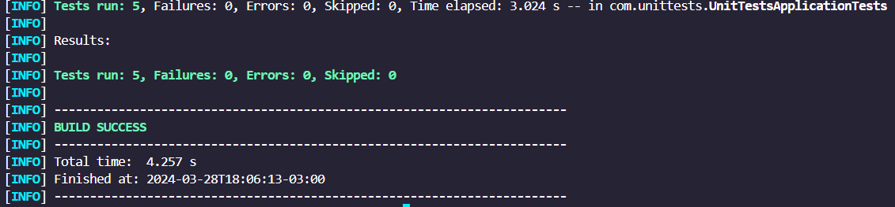

# Unit Tests

Unit testing is a crucial aspect of software development, ensuring that individual application components behave as expected. This project was used for me to learn how to implement unit tests using JUnit and Mockito in a Spring Boot environment.

## Dependencies

The project utilizes the following dependencies:

- **JUnit 5**: For writing and running unit tests.
- **Mockito**: For mocking dependencies and behavior verification.
- **Spring Boot Starter Data JPA**: For accessing relational databases.
- **Spring Boot Starter Web**: For building web applications.
- **H2 Database**: An in-memory database for development and testing purposes.
- **Spring Boot Starter Test**: For testing Spring Boot applications.

## Running the Tests

To run the unit tests, you can use your favorite IDE or run the following Maven command:

```bash
mvn test
```

This command will execute all the unit tests defined in the project and provide detailed output regarding the test results.

## Unit Tests Overview

1. **testFindByUserName**: Tests the `findByUsername` method of the `UserService` class by mocking the `UserRepository` dependency. Verifies that the method returns the expected user object when a valid username is provided.

2. **testSaveUser**: Tests the `save` method of the `UserService` class by mocking the `UserRepository` dependency. Verifies that the method correctly saves a user object and returns the saved user with the expected attributes.

3. **testUpdateUserWhenUserAlreadyExists**: Tests the `update` method of the `UserService` class by mocking the `UserRepository` dependency. Verifies that the method updates an existing user object with the provided data.

4. **testDeleteUserWhenUserExists**: Tests the `delete` method of the `UserService` class by mocking the `UserRepository` dependency. Verifies that the method deletes a user when the user exists.

5. **testDeleteUserWhenUserDoesNotExist**: Tests the `delete` method of the `UserService` class by mocking the `UserRepository` dependency. Verifies that the method throws a `UserException` when attempting to delete a non-existent user.

## Unit Tests Results



---

**Author: Jonas Dias | [Social Media](https://jonas-dias.netlify.app/) | Thank You**
